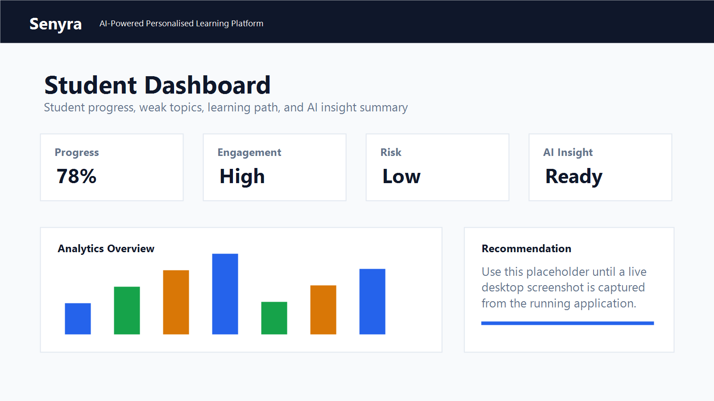
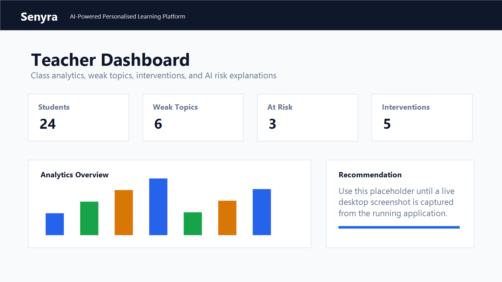
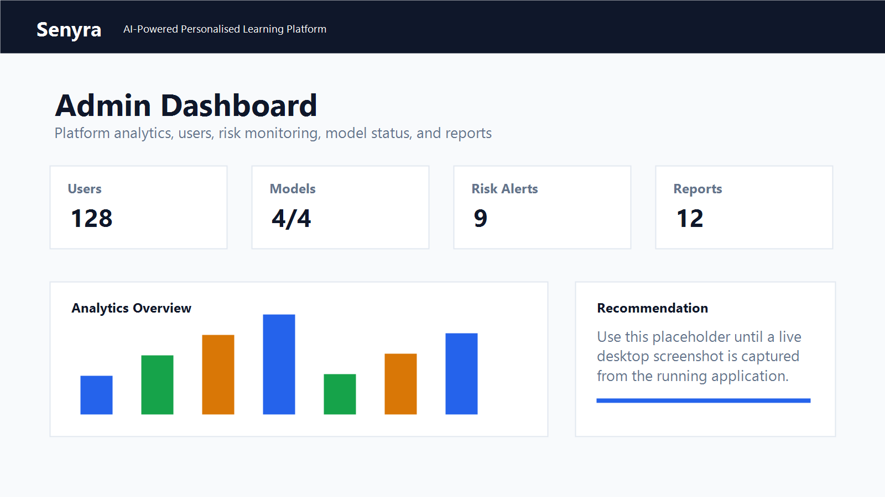
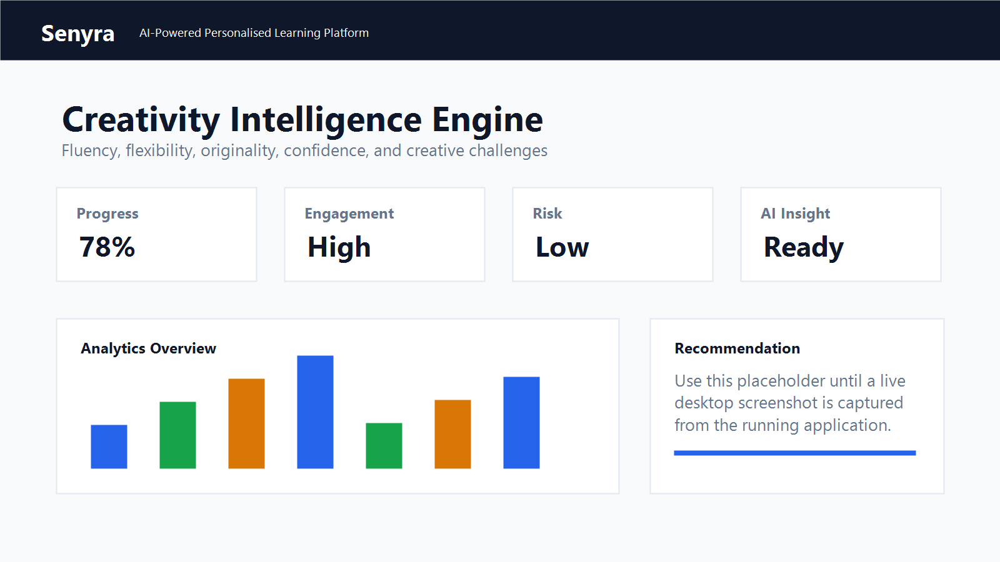
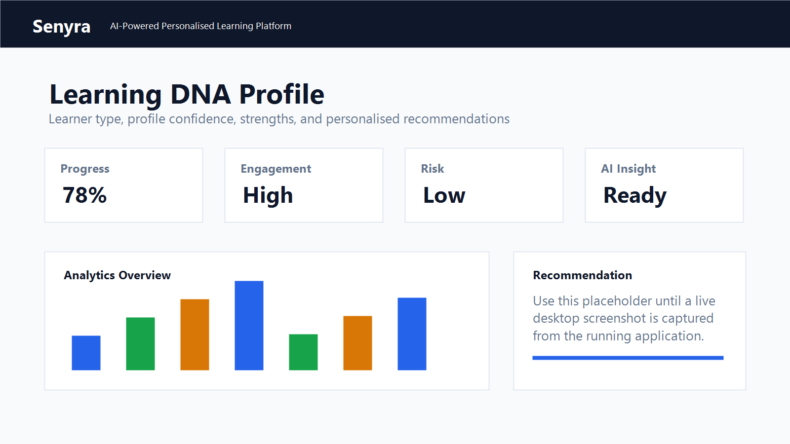
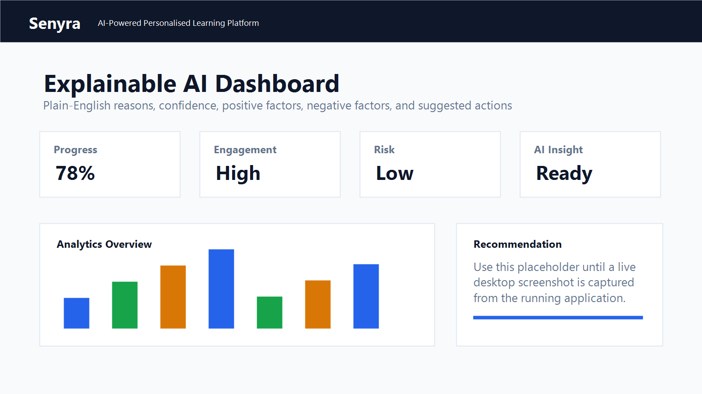

# Senyra Learning Platform

AI-Powered Personalised Learning Platform for Students, Teachers, and Administrators.

---

## Badges

<!-- Add project badges here, for example: build status, license, release, coverage, and deployment status. -->


---

## Overview

Senyra is an intelligent educational platform designed to improve learning outcomes through:

- Machine Learning
- Learning Analytics
- Adaptive Learning
- Creativity Assessment
- Explainable AI
- Risk Prediction

The platform supports students, teachers, and administrators through personalised educational experiences and AI-powered recommendations.

---

## Key Features

### Student Dashboard

- Learning Streak Tracking
- Weak Topic Detection
- AI Tutor
- Study Planner
- Flow State Analytics
- Learning DNA Profile
- Creativity Assessment
- Cognitive Risk Prediction
- Personalised Recommendations

### Teacher Dashboard

- Student Monitoring
- Class Analytics
- Intervention Plans
- Feedback System
- Learning Risk Monitoring
- Progress Tracking

### Admin Dashboard

- User Management
- Course Management
- Dataset Management
- ML Analytics
- Risk Monitoring
- Audit Logs
- Reports
- Platform Administration

---

## AI & Machine Learning Features

### Creativity Intelligence Engine

Measures:

- Fluency
- Flexibility
- Originality
- Creative Confidence
- Problem Solving Style

Includes:

- Remote Associates Test
- Alternative Uses Test
- Creative Scenario Challenges
- Word Association Chains

### Learning DNA Profiles

Classifies learners as:

- Analytical Learner
- Creative Learner
- Visual Learner
- Problem Solver
- Exploratory Learner

### Flow State Detection

Tracks:

- Study Duration
- Resource Engagement
- Quiz Activity
- Task Completion

Calculates:

- Flow Score
- Best Study Time
- Productivity Trends

### Cognitive Risk Prediction

Predicts student academic risk using:

- Attendance
- Quiz Scores
- Engagement
- Creativity Metrics
- Learning Behaviour
- Consistency Patterns

### Weak Topic Detection

Automatically identifies:

- Weak Subjects
- Weak Topics
- Learning Gaps
- Revision Priorities

### Adaptive Learning Paths

Creates personalised learning journeys based on:

- Performance
- Learning DNA
- Risk Level
- Weak Topics
- Engagement

### Explainable AI

Provides transparent explanations for:

- Risk Predictions
- Recommendations
- Learning Paths
- Student Performance Insights

---

## Technology Stack

### Frontend

- React 19
- Vite
- React Router
- Axios
- Recharts
- Tailwind CSS

### Backend

- FastAPI
- Python
- SQLAlchemy
- Pydantic

### Database

- SQLite for development
- PostgreSQL for production

### Authentication

- JWT Authentication
- Role-Based Access Control (RBAC)

### Machine Learning

- Pandas
- NumPy
- Scikit-learn
- Joblib

---

## System Architecture

```text
Frontend (React)
    |
    v
FastAPI REST API
    |
    v
Business Logic Layer
    |
    v
SQLite / PostgreSQL
    |
    v
Machine Learning Models
```

The frontend provides role-based dashboards and learning experiences. The FastAPI backend exposes REST endpoints, manages authentication and authorization, coordinates business logic, persists platform data, and serves machine learning predictions and explanations.

---

## Project Structure

```text
senyra-learning-platform/
|-- backend/
|-- frontend/
|-- datasets/
|-- database/
|-- docs/
|-- ml/
|-- screenshots/
|-- .env.example
|-- package.json
`-- README.md
```

### Folder Overview

- `backend/` - FastAPI application, API routes, authentication, database models, schemas, services, and backend ML utilities.
- `frontend/` - React and Vite application with student, teacher, and administrator pages.
- `datasets/` - Educational datasets used for analytics, model training, curriculum data, and local demonstrations.
- `database/` - Database-related project assets.
- `docs/` - Supporting documentation for local setup, deployment, and demo readiness.
- `ml/` - Machine learning workspace for model-related project assets.
- `screenshots/` - Placeholder folder for application screenshots and visual documentation.

---

## Running Locally

### Prerequisites

- Python 3.10+
- Node.js 18+
- npm

### Backend

From the project root:

```bash
python -m venv venv
```

On Windows PowerShell:

```powershell
.\venv\Scripts\Activate.ps1
pip install -r backend\requirements.txt
uvicorn backend.main:app --reload
```

Alternative backend command from inside the `backend` folder:

```bash
cd backend
pip install -r requirements.txt
uvicorn main:app --reload
```

The backend API runs at:

```text
http://127.0.0.1:8000
```

### Frontend

In a second terminal:

```bash
cd frontend
npm install
npm run dev
```

The frontend runs at:

```text
http://localhost:5173
```

### Environment Variables

Copy `.env.example` and update values as needed:

```bash
cp .env.example .env
```

The frontend can use `VITE_API_BASE_URL` to point to the backend API. If it is not set, the app uses the local FastAPI server by default.

---

## API Documentation

When the backend is running, FastAPI provides interactive API documentation:

- Swagger UI: `http://127.0.0.1:8000/docs`
- Health Check: `http://127.0.0.1:8000/health`
- Root API Info: `http://127.0.0.1:8000/`

### Core API Areas

- Authentication and account management
- Student registration and profiles
- Teacher dashboards and class monitoring
- Admin user, course, report, audit, and analytics management
- Courses, lessons, quizzes, certificates, and leaderboards
- AI tutor chat and learning assistant sessions
- Learning events and progress tracking
- Recommendation history and adaptive learning paths
- Creativity assessment
- Learning DNA profiles
- Flow state analytics
- Cognitive risk prediction
- Weak topic detection
- Explainable AI insights
- Dataset preparation and previews
- ML model predictions, model information, and feature importance

### Example Endpoints

```text
GET  /health
GET  /docs
POST /login
POST /students
POST /chat
GET  /dashboard
POST /ml/predict-risk
GET  /ml/model-info
GET  /datasets
POST /datasets/prepare
GET  /education/subjects
POST /education/study-plan
```

---

## Screenshots

### Student Dashboard



### Teacher Dashboard



### Admin Dashboard



### Creativity Intelligence Engine



### Learning DNA Profile



### Flow State Analytics


### Cognitive Risk Prediction


### Explainable AI Dashboard



---

## Datasets and Machine Learning

Senyra includes local datasets and training scripts for educational analytics and ML-powered recommendations.

Key dataset folders include:

- `datasets/student_performance/`
- `datasets/xapi_edu/`
- `datasets/maths/`
- `datasets/english/`
- `datasets/internal/`

Train the main educational ML pipeline:

```powershell
.\venv\Scripts\python.exe backend\ml\train_model.py
```

Train modular ML models:

```powershell
.\venv\Scripts\python.exe -m backend.ml.train_student_risk_model
.\venv\Scripts\python.exe -m backend.ml.train_engagement_model
.\venv\Scripts\python.exe -m backend.ml.train_recommendation_model
```

Saved models are stored in:

```text
backend/ml/saved_models/
```

---

## Documentation

Additional documentation is available in the `docs/` folder:

- `docs/RUNNING_LOCALLY.md`
- `docs/DEPLOYMENT.md`
- `docs/DEMO_READINESS.md`

---

## Author

**Abdia**  
Senyra Learning Platform

---

## License

License information can be added here.
